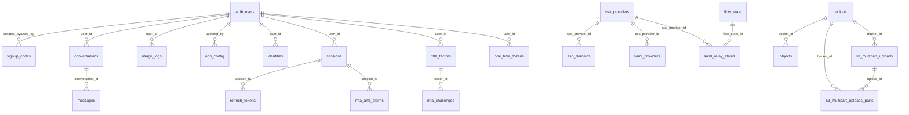

# Supabase Database Structure - Complete Schema Documentation

## Overview
This document provides a comprehensive mapping of the Supabase database structure for project `gnleuaaopvjlvmvxmoey`, including all schemas, tables, columns, relationships, and constraints.

## Database Statistics
- **Total Tables**: 35 tables across 6 schemas
- **Primary Schemas**: 6 (public, auth, storage, vault, realtime, supabase_migrations)
- **Total Relationships**: 25 foreign key relationships
- **RLS Enabled**: Most tables have Row Level Security enabled

---

## Schema Breakdown

### 1. PUBLIC Schema (Application Layer)
*Application-specific tables for the FBA course system*

#### **signup_codes**
**Purpose**: Manages invitation codes for user registration
- **Size**: 72 kB, ~7 active records
- **RLS**: Enabled

| Column | Type | Constraints | Description |
|--------|------|-------------|-------------|
| id | uuid | PRIMARY KEY, NOT NULL, DEFAULT gen_random_uuid() | Unique identifier |
| code | varchar | NOT NULL, UNIQUE | Invitation code string |
| expires_at | timestamptz | NULLABLE | Code expiration timestamp |
| used_by | uuid | NULLABLE, FK → auth.users.id | User who used the code |
| used_at | timestamptz | NULLABLE | When code was used |
| created_by | uuid | NULLABLE, FK → auth.users.id | User who created the code |
| created_at | timestamptz | NULLABLE, DEFAULT now() | Creation timestamp |
| is_admin | boolean | NULLABLE, DEFAULT false | Admin privileges flag |

**Relationships**:
- `used_by` → `auth.users.id`
- `created_by` → `auth.users.id`

#### **conversations**
**Purpose**: Stores chat conversations between users and the system
- **Size**: 56 kB, ~35 active records
- **RLS**: Enabled

| Column | Type | Constraints | Description |
|--------|------|-------------|-------------|
| id | uuid | PRIMARY KEY, NOT NULL, DEFAULT gen_random_uuid() | Unique identifier |
| user_id | uuid | NOT NULL, FK → auth.users.id | Owner of the conversation |
| title | varchar | NULLABLE | Conversation title |
| created_at | timestamptz | NULLABLE, DEFAULT now() | Creation timestamp |
| updated_at | timestamptz | NULLABLE, DEFAULT now() | Last update timestamp |
| is_active | boolean | NULLABLE, DEFAULT true | Active status |

**Relationships**:
- `user_id` → `auth.users.id`
- `id` ← `messages.conversation_id`

#### **messages**
**Purpose**: Individual messages within conversations
- **Size**: 280 kB, ~114 active records
- **RLS**: Enabled

| Column | Type | Constraints | Description |
|--------|------|-------------|-------------|
| id | uuid | PRIMARY KEY, NOT NULL, DEFAULT gen_random_uuid() | Unique identifier |
| conversation_id | uuid | NOT NULL, FK → conversations.id | Parent conversation |
| role | varchar | NOT NULL, CHECK ('user' OR 'assistant') | Message sender role |
| content | text | NOT NULL | Message content |
| metadata | jsonb | NULLABLE | Additional message metadata |
| created_at | timestamptz | NULLABLE, DEFAULT now() | Creation timestamp |

**Relationships**:
- `conversation_id` → `conversations.id`

#### **usage_logs**
**Purpose**: Tracks system usage and performance metrics
- **Size**: 168 kB, ~57 active records
- **RLS**: Enabled

| Column | Type | Constraints | Description |
|--------|------|-------------|-------------|
| id | uuid | PRIMARY KEY, NOT NULL, DEFAULT gen_random_uuid() | Unique identifier |
| user_id | uuid | NOT NULL, FK → auth.users.id | User who made the request |
| question_text | text | NULLABLE | User's question |
| response_time_ms | integer | NULLABLE | Response time in milliseconds |
| tokens_used | integer | NULLABLE | AI tokens consumed |
| pinecone_results | jsonb | NULLABLE | Vector search results |
| created_at | timestamptz | NULLABLE, DEFAULT now() | Creation timestamp |

**Relationships**:
- `user_id` → `auth.users.id`

#### **app_config**
**Purpose**: Application-wide configuration settings
- **Size**: 32 kB, ~4 active records
- **RLS**: Enabled

| Column | Type | Constraints | Description |
|--------|------|-------------|-------------|
| key | varchar | PRIMARY KEY, NOT NULL | Configuration key |
| value | jsonb | NULLABLE | Configuration value |
| updated_at | timestamptz | NULLABLE, DEFAULT now() | Last update timestamp |
| updated_by | uuid | NULLABLE, FK → auth.users.id | User who updated |

**Relationships**:
- `updated_by` → `auth.users.id`

---

### 2. AUTH Schema (Authentication Layer)
*Supabase's built-in authentication system*

#### **users** (Central User Table)
**Purpose**: Core user authentication and profile data
- **Size**: 160 kB, ~9 active records
- **RLS**: Enabled

| Column | Type | Constraints | Description |
|--------|------|-------------|-------------|
| id | uuid | PRIMARY KEY, NOT NULL | Unique user identifier |
| instance_id | uuid | NULLABLE | Multi-tenant instance ID |
| aud | varchar | NULLABLE | Audience claim |
| role | varchar | NULLABLE | User role |
| email | varchar | NULLABLE | Email address |
| encrypted_password | varchar | NULLABLE | Hashed password |
| email_confirmed_at | timestamptz | NULLABLE | Email confirmation timestamp |
| invited_at | timestamptz | NULLABLE | Invitation timestamp |
| confirmation_token | varchar | NULLABLE | Email confirmation token |
| confirmation_sent_at | timestamptz | NULLABLE | Confirmation email sent time |
| recovery_token | varchar | NULLABLE | Password recovery token |
| recovery_sent_at | timestamptz | NULLABLE | Recovery email sent time |
| email_change_token_new | varchar | NULLABLE | New email change token |
| email_change | varchar | NULLABLE | New email address |
| email_change_sent_at | timestamptz | NULLABLE | Email change sent time |
| last_sign_in_at | timestamptz | NULLABLE | Last sign-in timestamp |
| raw_app_meta_data | jsonb | NULLABLE | Application metadata |
| raw_user_meta_data | jsonb | NULLABLE | User metadata |
| is_super_admin | boolean | NULLABLE | Super admin flag |
| created_at | timestamptz | NULLABLE | Account creation time |
| updated_at | timestamptz | NULLABLE | Last update time |
| phone | text | NULLABLE, UNIQUE | Phone number |
| phone_confirmed_at | timestamptz | NULLABLE | Phone confirmation time |
| phone_change | text | NULLABLE | New phone number |
| phone_change_token | varchar | NULLABLE | Phone change token |
| phone_change_sent_at | timestamptz | NULLABLE | Phone change sent time |
| confirmed_at | timestamptz | NULLABLE, GENERATED | Confirmation time (computed) |
| email_change_token_current | varchar | NULLABLE | Current email change token |
| email_change_confirm_status | smallint | NULLABLE, DEFAULT 0, CHECK (0-2) | Email change status |
| banned_until | timestamptz | NULLABLE | Account ban expiration |
| reauthentication_token | varchar | NULLABLE | Reauthentication token |
| reauthentication_sent_at | timestamptz | NULLABLE | Reauthentication sent time |
| is_sso_user | boolean | NOT NULL, DEFAULT false | SSO user flag |
| deleted_at | timestamptz | NULLABLE | Soft deletion timestamp |
| is_anonymous | boolean | NOT NULL, DEFAULT false | Anonymous user flag |

**Relationships (Outbound)**:
- `id` ← Multiple tables reference this as FK

#### **refresh_tokens**
**Purpose**: JWT refresh token management
- **Size**: 160 kB, ~8 active records
- **RLS**: Enabled

| Column | Type | Constraints | Description |
|--------|------|-------------|-------------|
| id | bigint | PRIMARY KEY, NOT NULL, AUTO_INCREMENT | Unique identifier |
| instance_id | uuid | NULLABLE | Multi-tenant instance ID |
| token | varchar | NULLABLE, UNIQUE | Refresh token value |
| user_id | varchar | NULLABLE | User identifier |
| revoked | boolean | NULLABLE | Revocation status |
| created_at | timestamptz | NULLABLE | Creation timestamp |
| updated_at | timestamptz | NULLABLE | Update timestamp |
| parent | varchar | NULLABLE | Parent token reference |
| session_id | uuid | NULLABLE, FK → sessions.id | Associated session |

**Relationships**:
- `session_id` → `sessions.id`

#### **sessions**
**Purpose**: User session management
- **Size**: 112 kB, ~6 active records
- **RLS**: Enabled

| Column | Type | Constraints | Description |
|--------|------|-------------|-------------|
| id | uuid | PRIMARY KEY, NOT NULL | Unique session identifier |
| user_id | uuid | NOT NULL, FK → users.id | Session owner |
| created_at | timestamptz | NULLABLE | Session creation time |
| updated_at | timestamptz | NULLABLE | Last update time |
| factor_id | uuid | NULLABLE | MFA factor reference |
| aal | aal_level | NULLABLE, ENUM(aal1,aal2,aal3) | Authentication assurance level |
| not_after | timestamptz | NULLABLE | Session expiration time |
| refreshed_at | timestamp | NULLABLE | Last refresh time |
| user_agent | text | NULLABLE | Client user agent |
| ip | inet | NULLABLE | Client IP address |
| tag | text | NULLABLE | Session tag |

**Relationships**:
- `user_id` → `users.id`
- `id` ← `refresh_tokens.session_id`
- `id` ← `mfa_amr_claims.session_id`

#### **identities**
**Purpose**: OAuth and external identity provider connections
- **Size**: 80 kB, ~9 active records
- **RLS**: Enabled

| Column | Type | Constraints | Description |
|--------|------|-------------|-------------|
| id | uuid | PRIMARY KEY, NOT NULL, DEFAULT gen_random_uuid() | Unique identifier |
| provider_id | text | NOT NULL | Provider-specific user ID |
| user_id | uuid | NOT NULL, FK → users.id | Associated user |
| identity_data | jsonb | NOT NULL | Provider identity data |
| provider | text | NOT NULL | Identity provider name |
| last_sign_in_at | timestamptz | NULLABLE | Last sign-in time |
| created_at | timestamptz | NULLABLE | Creation timestamp |
| updated_at | timestamptz | NULLABLE | Update timestamp |
| email | text | NULLABLE, GENERATED | Extracted email |

**Relationships**:
- `user_id` → `users.id`

#### **mfa_factors**
**Purpose**: Multi-factor authentication factors
- **Size**: 56 kB, ~0 active records
- **RLS**: Enabled

| Column | Type | Constraints | Description |
|--------|------|-------------|-------------|
| id | uuid | PRIMARY KEY, NOT NULL | Unique factor identifier |
| user_id | uuid | NOT NULL, FK → users.id | Factor owner |
| friendly_name | text | NULLABLE | User-friendly name |
| factor_type | factor_type | NOT NULL, ENUM(totp,webauthn,phone) | Factor type |
| status | factor_status | NOT NULL, ENUM(unverified,verified) | Verification status |
| created_at | timestamptz | NOT NULL | Creation timestamp |
| updated_at | timestamptz | NOT NULL | Update timestamp |
| secret | text | NULLABLE | TOTP secret |
| phone | text | NULLABLE | Phone number |
| last_challenged_at | timestamptz | NULLABLE, UNIQUE | Last challenge time |
| web_authn_credential | jsonb | NULLABLE | WebAuthn credential data |
| web_authn_aaguid | uuid | NULLABLE | WebAuthn AAGUID |

**Relationships**:
- `user_id` → `users.id`
- `id` ← `mfa_challenges.factor_id`

#### **mfa_challenges**
**Purpose**: MFA challenge tracking
- **Size**: 24 kB, ~0 active records
- **RLS**: Enabled

| Column | Type | Constraints | Description |
|--------|------|-------------|-------------|
| id | uuid | PRIMARY KEY, NOT NULL | Unique challenge identifier |
| factor_id | uuid | NOT NULL, FK → mfa_factors.id | Associated factor |
| created_at | timestamptz | NOT NULL | Challenge creation time |
| verified_at | timestamptz | NULLABLE | Verification timestamp |
| ip_address | inet | NOT NULL | Client IP address |
| otp_code | text | NULLABLE | OTP code |
| web_authn_session_data | jsonb | NULLABLE | WebAuthn session data |

**Relationships**:
- `factor_id` → `mfa_factors.id`

#### **mfa_amr_claims**
**Purpose**: Authentication method reference claims
- **Size**: 80 kB, ~4 active records
- **RLS**: Enabled

| Column | Type | Constraints | Description |
|--------|------|-------------|-------------|
| id | uuid | PRIMARY KEY, NOT NULL | Unique claim identifier |
| session_id | uuid | NOT NULL, FK → sessions.id | Associated session |
| created_at | timestamptz | NOT NULL | Creation timestamp |
| updated_at | timestamptz | NOT NULL | Update timestamp |
| authentication_method | text | NOT NULL | Authentication method used |

**Relationships**:
- `session_id` → `sessions.id`

#### **sso_providers**
**Purpose**: SSO identity provider management
- **Size**: 24 kB, ~0 active records
- **RLS**: Enabled

| Column | Type | Constraints | Description |
|--------|------|-------------|-------------|
| id | uuid | PRIMARY KEY, NOT NULL | Unique provider identifier |
| resource_id | text | NULLABLE, CHECK (length > 0) | Resource identifier |
| created_at | timestamptz | NULLABLE | Creation timestamp |
| updated_at | timestamptz | NULLABLE | Update timestamp |

**Relationships**:
- `id` ← `sso_domains.sso_provider_id`
- `id` ← `saml_providers.sso_provider_id`
- `id` ← `saml_relay_states.sso_provider_id`

#### **sso_domains**
**Purpose**: SSO domain mapping
- **Size**: 32 kB, ~0 active records
- **RLS**: Enabled

| Column | Type | Constraints | Description |
|--------|------|-------------|-------------|
| id | uuid | PRIMARY KEY, NOT NULL | Unique domain identifier |
| sso_provider_id | uuid | NOT NULL, FK → sso_providers.id | Associated SSO provider |
| domain | text | NOT NULL, CHECK (length > 0) | Domain name |
| created_at | timestamptz | NULLABLE | Creation timestamp |
| updated_at | timestamptz | NULLABLE | Update timestamp |

**Relationships**:
- `sso_provider_id` → `sso_providers.id`

#### **saml_providers**
**Purpose**: SAML identity provider configuration
- **Size**: 32 kB, ~0 active records
- **RLS**: Enabled

| Column | Type | Constraints | Description |
|--------|------|-------------|-------------|
| id | uuid | PRIMARY KEY, NOT NULL | Unique provider identifier |
| sso_provider_id | uuid | NOT NULL, FK → sso_providers.id | Associated SSO provider |
| entity_id | text | NOT NULL, UNIQUE, CHECK (length > 0) | SAML entity ID |
| metadata_xml | text | NOT NULL, CHECK (length > 0) | SAML metadata XML |
| metadata_url | text | NULLABLE, CHECK (length > 0) | SAML metadata URL |
| attribute_mapping | jsonb | NULLABLE | Attribute mapping configuration |
| created_at | timestamptz | NULLABLE | Creation timestamp |
| updated_at | timestamptz | NULLABLE | Update timestamp |
| name_id_format | text | NULLABLE | Name ID format |

**Relationships**:
- `sso_provider_id` → `sso_providers.id`

#### **saml_relay_states**
**Purpose**: SAML relay state management
- **Size**: 40 kB, ~0 active records
- **RLS**: Enabled

| Column | Type | Constraints | Description |
|--------|------|-------------|-------------|
| id | uuid | PRIMARY KEY, NOT NULL | Unique state identifier |
| sso_provider_id | uuid | NOT NULL, FK → sso_providers.id | Associated SSO provider |
| request_id | text | NOT NULL, CHECK (length > 0) | SAML request ID |
| for_email | text | NULLABLE | Target email address |
| redirect_to | text | NULLABLE | Redirect URL |
| created_at | timestamptz | NULLABLE | Creation timestamp |
| updated_at | timestamptz | NULLABLE | Update timestamp |
| flow_state_id | uuid | NULLABLE, FK → flow_state.id | Associated flow state |

**Relationships**:
- `sso_provider_id` → `sso_providers.id`
- `flow_state_id` → `flow_state.id`

#### **flow_state**
**Purpose**: PKCE flow state management
- **Size**: 80 kB, ~5 active records
- **RLS**: Enabled

| Column | Type | Constraints | Description |
|--------|------|-------------|-------------|
| id | uuid | PRIMARY KEY, NOT NULL | Unique state identifier |
| user_id | uuid | NULLABLE | Associated user |
| auth_code | text | NOT NULL | Authorization code |
| code_challenge_method | code_challenge_method | NOT NULL, ENUM(s256,plain) | Challenge method |
| code_challenge | text | NOT NULL | Code challenge |
| provider_type | text | NOT NULL | Provider type |
| provider_access_token | text | NULLABLE | Provider access token |
| provider_refresh_token | text | NULLABLE | Provider refresh token |
| created_at | timestamptz | NULLABLE | Creation timestamp |
| updated_at | timestamptz | NULLABLE | Update timestamp |
| authentication_method | text | NOT NULL | Authentication method |
| auth_code_issued_at | timestamptz | NULLABLE | Code issue timestamp |

**Relationships**:
- `id` ← `saml_relay_states.flow_state_id`

#### **one_time_tokens**
**Purpose**: One-time token management
- **Size**: 112 kB, ~2 active records
- **RLS**: Enabled

| Column | Type | Constraints | Description |
|--------|------|-------------|-------------|
| id | uuid | PRIMARY KEY, NOT NULL | Unique token identifier |
| user_id | uuid | NOT NULL, FK → users.id | Token owner |
| token_type | one_time_token_type | NOT NULL, ENUM(...) | Token type |
| token_hash | text | NOT NULL, CHECK (length > 0) | Hashed token value |
| relates_to | text | NOT NULL | Related identifier |
| created_at | timestamp | NOT NULL, DEFAULT now() | Creation timestamp |
| updated_at | timestamp | NOT NULL, DEFAULT now() | Update timestamp |

**Token Types**: confirmation_token, reauthentication_token, recovery_token, email_change_token_new, email_change_token_current, phone_change_token

**Relationships**:
- `user_id` → `users.id`

#### **audit_log_entries**
**Purpose**: User action audit trail
- **Size**: 112 kB, ~143 active records
- **RLS**: Enabled

| Column | Type | Constraints | Description |
|--------|------|-------------|-------------|
| id | uuid | PRIMARY KEY, NOT NULL | Unique log entry identifier |
| instance_id | uuid | NULLABLE | Multi-tenant instance ID |
| payload | json | NULLABLE | Action payload data |
| created_at | timestamptz | NULLABLE | Action timestamp |
| ip_address | varchar | NOT NULL, DEFAULT '' | Client IP address |

#### **instances**
**Purpose**: Multi-tenant instance management
- **Size**: 16 kB, ~0 active records
- **RLS**: Enabled

| Column | Type | Constraints | Description |
|--------|------|-------------|-------------|
| id | uuid | PRIMARY KEY, NOT NULL | Unique instance identifier |
| uuid | uuid | NULLABLE | Instance UUID |
| raw_base_config | text | NULLABLE | Base configuration |
| created_at | timestamptz | NULLABLE | Creation timestamp |
| updated_at | timestamptz | NULLABLE | Update timestamp |

#### **schema_migrations**
**Purpose**: Auth schema version tracking
- **Size**: 24 kB, ~61 active records
- **RLS**: Enabled

| Column | Type | Constraints | Description |
|--------|------|-------------|-------------|
| version | varchar | PRIMARY KEY, NOT NULL | Migration version |

---

### 3. STORAGE Schema (File Storage Layer)
*Supabase's file storage system*

#### **buckets**
**Purpose**: File storage bucket management
- **Size**: 24 kB, ~0 active records
- **RLS**: Enabled

| Column | Type | Constraints | Description |
|--------|------|-------------|-------------|
| id | text | PRIMARY KEY, NOT NULL | Unique bucket identifier |
| name | text | NOT NULL | Bucket name |
| owner | uuid | NULLABLE | Bucket owner (deprecated) |
| created_at | timestamptz | NULLABLE, DEFAULT now() | Creation timestamp |
| updated_at | timestamptz | NULLABLE, DEFAULT now() | Update timestamp |
| public | boolean | NULLABLE, DEFAULT false | Public access flag |
| avif_autodetection | boolean | NULLABLE, DEFAULT false | AVIF detection flag |
| file_size_limit | bigint | NULLABLE | File size limit |
| allowed_mime_types | text[] | NULLABLE | Allowed MIME types |
| owner_id | text | NULLABLE | Current owner ID |

**Relationships**:
- `id` ← `objects.bucket_id`
- `id` ← `s3_multipart_uploads.bucket_id`
- `id` ← `s3_multipart_uploads_parts.bucket_id`

#### **objects**
**Purpose**: File object metadata and storage
- **Size**: 40 kB, ~0 active records
- **RLS**: Enabled

| Column | Type | Constraints | Description |
|--------|------|-------------|-------------|
| id | uuid | PRIMARY KEY, NOT NULL, DEFAULT gen_random_uuid() | Unique object identifier |
| bucket_id | text | NULLABLE, FK → buckets.id | Parent bucket |
| name | text | NULLABLE | Object name/path |
| owner | uuid | NULLABLE | Object owner (deprecated) |
| created_at | timestamptz | NULLABLE, DEFAULT now() | Creation timestamp |
| updated_at | timestamptz | NULLABLE, DEFAULT now() | Update timestamp |
| last_accessed_at | timestamptz | NULLABLE, DEFAULT now() | Last access time |
| metadata | jsonb | NULLABLE | Object metadata |
| path_tokens | text[] | NULLABLE, GENERATED | Path components |
| version | text | NULLABLE | Object version |
| owner_id | text | NULLABLE | Current owner ID |
| user_metadata | jsonb | NULLABLE | User metadata |

**Relationships**:
- `bucket_id` → `buckets.id`

#### **s3_multipart_uploads**
**Purpose**: S3 multipart upload management
- **Size**: 24 kB, ~0 active records
- **RLS**: Enabled

| Column | Type | Constraints | Description |
|--------|------|-------------|-------------|
| id | text | PRIMARY KEY, NOT NULL | Unique upload identifier |
| in_progress_size | bigint | NOT NULL, DEFAULT 0 | Current upload size |
| upload_signature | text | NOT NULL | Upload signature |
| bucket_id | text | NOT NULL, FK → buckets.id | Target bucket |
| key | text | NOT NULL | Object key |
| version | text | NOT NULL | Version identifier |
| owner_id | text | NULLABLE | Upload owner |
| created_at | timestamptz | NOT NULL, DEFAULT now() | Creation timestamp |
| user_metadata | jsonb | NULLABLE | User metadata |

**Relationships**:
- `bucket_id` → `buckets.id`
- `id` ← `s3_multipart_uploads_parts.upload_id`

#### **s3_multipart_uploads_parts**
**Purpose**: S3 multipart upload parts tracking
- **Size**: 16 kB, ~0 active records
- **RLS**: Enabled

| Column | Type | Constraints | Description |
|--------|------|-------------|-------------|
| id | uuid | PRIMARY KEY, NOT NULL, DEFAULT gen_random_uuid() | Unique part identifier |
| upload_id | text | NOT NULL, FK → s3_multipart_uploads.id | Parent upload |
| size | bigint | NOT NULL, DEFAULT 0 | Part size |
| part_number | integer | NOT NULL | Part number |
| bucket_id | text | NOT NULL, FK → buckets.id | Target bucket |
| key | text | NOT NULL | Object key |
| etag | text | NOT NULL | Part ETag |
| owner_id | text | NULLABLE | Part owner |
| version | text | NOT NULL | Version identifier |
| created_at | timestamptz | NOT NULL, DEFAULT now() | Creation timestamp |

**Relationships**:
- `upload_id` → `s3_multipart_uploads.id`
- `bucket_id` → `buckets.id`

#### **migrations**
**Purpose**: Storage schema version tracking
- **Size**: 40 kB, ~26 active records
- **RLS**: Enabled

| Column | Type | Constraints | Description |
|--------|------|-------------|-------------|
| id | integer | PRIMARY KEY, NOT NULL | Migration identifier |
| name | varchar | NOT NULL, UNIQUE | Migration name |
| hash | varchar | NOT NULL | Migration hash |
| executed_at | timestamp | NULLABLE, DEFAULT CURRENT_TIMESTAMP | Execution timestamp |

---

### 4. VAULT Schema (Secrets Management)
*Supabase's encrypted secrets storage*

#### **secrets**
**Purpose**: Encrypted secrets storage
- **Size**: 24 kB, ~0 active records
- **RLS**: Disabled

| Column | Type | Constraints | Description |
|--------|------|-------------|-------------|
| id | uuid | PRIMARY KEY, NOT NULL, DEFAULT gen_random_uuid() | Unique secret identifier |
| name | text | NULLABLE | Secret name |
| description | text | NOT NULL, DEFAULT '' | Secret description |
| secret | text | NOT NULL | Encrypted secret value |
| key_id | uuid | NULLABLE | Encryption key ID |
| nonce | bytea | NULLABLE, DEFAULT vault._crypto_aead_det_noncegen() | Encryption nonce |
| created_at | timestamptz | NOT NULL, DEFAULT CURRENT_TIMESTAMP | Creation timestamp |
| updated_at | timestamptz | NOT NULL, DEFAULT CURRENT_TIMESTAMP | Update timestamp |

---

### 5. REALTIME Schema (Real-time Features)
*Supabase's real-time functionality*

#### **subscription**
**Purpose**: Real-time subscription management
- **Size**: 32 kB, ~0 active records
- **RLS**: Disabled

| Column | Type | Constraints | Description |
|--------|------|-------------|-------------|
| id | bigint | PRIMARY KEY, NOT NULL, IDENTITY | Unique subscription identifier |
| subscription_id | uuid | NOT NULL | Subscription UUID |
| entity | regclass | NOT NULL | Target entity |
| filters | user_defined_filter[] | NOT NULL, DEFAULT '{}' | Subscription filters |
| claims | jsonb | NOT NULL | User claims |
| claims_role | regrole | NOT NULL, GENERATED | Extracted role |
| created_at | timestamp | NOT NULL, DEFAULT timezone('utc', now()) | Creation timestamp |

#### **messages**
**Purpose**: Real-time message broadcasting
- **Size**: 0 bytes, ~0 active records
- **RLS**: Enabled

| Column | Type | Constraints | Description |
|--------|------|-------------|-------------|
| id | uuid | PRIMARY KEY, NOT NULL, DEFAULT gen_random_uuid() | Unique message identifier |
| topic | text | NOT NULL | Message topic |
| extension | text | NOT NULL | Extension type |
| payload | jsonb | NULLABLE | Message payload |
| event | text | NULLABLE | Event type |
| private | boolean | NULLABLE, DEFAULT false | Private message flag |
| updated_at | timestamp | NOT NULL, DEFAULT now() | Update timestamp |
| inserted_at | timestamp | NOT NULL, DEFAULT now() | Insertion timestamp |

**Composite Primary Key**: (inserted_at, id)

#### **schema_migrations**
**Purpose**: Realtime schema version tracking
- **Size**: 24 kB, ~62 active records
- **RLS**: Disabled

| Column | Type | Constraints | Description |
|--------|------|-------------|-------------|
| version | bigint | PRIMARY KEY, NOT NULL | Migration version |
| inserted_at | timestamp | NULLABLE | Installation timestamp |

---

### 6. SUPABASE_MIGRATIONS Schema (Migration Tracking)
*Supabase's migration management*

#### **schema_migrations**
**Purpose**: Global migration tracking
- **Size**: 80 kB, ~16 active records
- **RLS**: Disabled

| Column | Type | Constraints | Description |
|--------|------|-------------|-------------|
| version | text | PRIMARY KEY, NOT NULL | Migration version |
| statements | text[] | NULLABLE | Migration statements |
| name | text | NULLABLE | Migration name |
| created_by | text | NULLABLE | Creator identifier |
| idempotency_key | text | NULLABLE, UNIQUE | Idempotency key |

---

## Relationship Mapping

### Core Application Relationships

### Foreign Key Constraints Summary

| Source Table | Source Column | Target Table | Target Column | Relationship Type |
|--------------|---------------|--------------|---------------|-------------------|
| signup_codes | created_by | auth.users | id | Many-to-One |
| signup_codes | used_by | auth.users | id | Many-to-One |
| conversations | user_id | auth.users | id | Many-to-One |
| messages | conversation_id | conversations | id | Many-to-One |
| usage_logs | user_id | auth.users | id | Many-to-One |
| app_config | updated_by | auth.users | id | Many-to-One |
| refresh_tokens | session_id | sessions | id | Many-to-One |
| identities | user_id | auth.users | id | Many-to-One |
| sessions | user_id | auth.users | id | Many-to-One |
| mfa_factors | user_id | auth.users | id | Many-to-One |
| mfa_challenges | factor_id | mfa_factors | id | Many-to-One |
| mfa_amr_claims | session_id | sessions | id | Many-to-One |
| sso_domains | sso_provider_id | sso_providers | id | Many-to-One |
| saml_providers | sso_provider_id | sso_providers | id | Many-to-One |
| saml_relay_states | sso_provider_id | sso_providers | id | Many-to-One |
| saml_relay_states | flow_state_id | flow_state | id | Many-to-One |
| one_time_tokens | user_id | auth.users | id | Many-to-One |
| objects | bucket_id | buckets | id | Many-to-One |
| s3_multipart_uploads | bucket_id | buckets | id | Many-to-One |
| s3_multipart_uploads_parts | upload_id | s3_multipart_uploads | id | Many-to-One |
| s3_multipart_uploads_parts | bucket_id | buckets | id | Many-to-One |

---

## Security Configuration

### Row Level Security (RLS)
- **Enabled**: Most application and auth tables
- **Disabled**: Migration tracking tables, vault secrets, realtime subscriptions
- **Forced**: None

### Data Types and Constraints

#### Custom Enums
- **aal_level**: `aal1`, `aal2`, `aal3`
- **factor_type**: `totp`, `webauthn`, `phone`
- **factor_status**: `unverified`, `verified`
- **code_challenge_method**: `s256`, `plain`
- **one_time_token_type**: `confirmation_token`, `reauthentication_token`, `recovery_token`, `email_change_token_new`, `email_change_token_current`, `phone_change_token`

#### Common Patterns
- **UUID Primary Keys**: Most tables use `gen_random_uuid()`
- **Timestamp Tracking**: `created_at`, `updated_at` with `now()` defaults
- **Soft Deletes**: `deleted_at` fields in some tables
- **JSONB Metadata**: Flexible metadata storage across tables

---

## Application Architecture Insights

### User Management Flow
1. **Registration**: Users created via invite codes (`signup_codes`)
2. **Authentication**: Full Supabase auth stack with MFA support
3. **Sessions**: Tracked with JWT refresh tokens
4. **Conversations**: Users can have multiple chat conversations
5. **Usage Tracking**: All interactions logged with performance metrics

### Data Flow
1. **User Registration** → `signup_codes` → `auth.users`
2. **Authentication** → `auth.sessions` → `auth.refresh_tokens`
3. **Conversations** → `conversations` → `messages`
4. **Usage Analytics** → `usage_logs` (with Pinecone integration)
5. **Configuration** → `app_config` (flexible JSON storage)

### Integration Points
- **Pinecone Integration**: Referenced in `usage_logs.pinecone_results`
- **AI/LLM Integration**: Message role system (`user`/`assistant`)
- **Real-time Features**: Available but not heavily utilized
- **File Storage**: Configured but not actively used
- **SSO/SAML**: Configured but not actively used

---

## Performance Characteristics

### Table Sizes (Current)
- **Largest**: `messages` (280 kB, 114 records)
- **Most Active**: `usage_logs` (168 kB, 57 records)
- **Authentication**: `auth.users` (160 kB, 9 users)
- **Conversations**: `conversations` (56 kB, 35 conversations)

### Growth Patterns
- **High Growth**: `messages`, `usage_logs` (per user activity)
- **Moderate Growth**: `conversations` (per user session)
- **Low Growth**: `signup_codes`, `app_config` (administrative)
- **Static**: Most auth tables (per user registration)

### Optimization Opportunities
1. **Indexing**: Consider indexes on frequently queried columns
2. **Partitioning**: `usage_logs` could benefit from time-based partitioning
3. **Archiving**: Old conversations/messages could be archived
4. **Caching**: `app_config` could be cached
5. **Monitoring**: Track query performance on growing tables

---

## Conclusion

This database structure represents a well-architected FBA course system with:

- **Robust Authentication**: Full Supabase auth with MFA and SSO support
- **Flexible Conversation System**: Supports multi-turn AI interactions
- **Comprehensive Logging**: Detailed usage and performance tracking
- **Scalable Architecture**: Proper normalization and relationship design
- **Security First**: RLS enabled across application tables
- **Integration Ready**: Pinecone vector DB integration for AI features

The system is designed to scale from current usage (~9 users) to enterprise-level deployment while maintaining security and performance standards. 